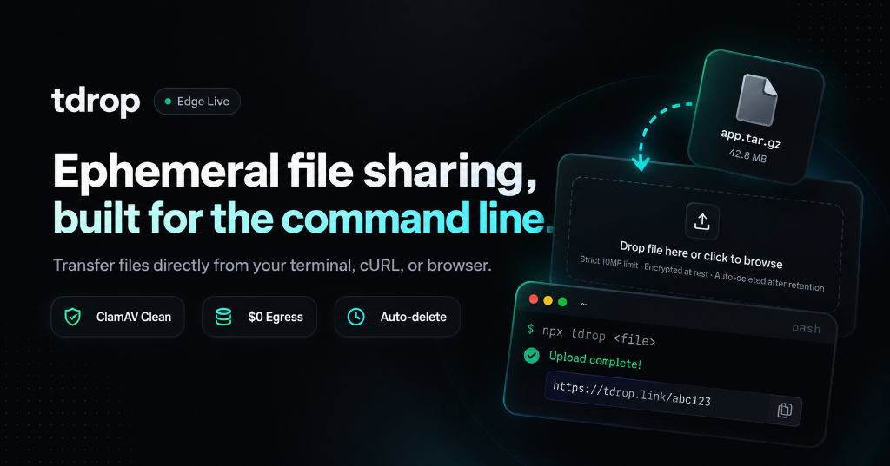

<p align="center">
  
</p>

<p align="center">
  
  <span style="font-size: 1.8rem; font-weight: 700; margin-left: 8px;">tdrop</span>
  <br>
  <em>Ephemeral file sharing for everyone — from your terminal, web browser, or command line.</em>
</p>

<p align="center">
  <a href="https://opensource.org/licenses/MIT"></a>
  <a href="https://github.com/TAGISWILD/tdrop/actions/workflows/ci.yml"></a>
  <a href="https://github.com/mrtag08/dotvet"></a>
  <a href="https://www.npmjs.com/package/tdrop"></a>
  <a href="https://github.com/microsoft/winget-pkgs/pull/446668"></a>
</p>

**tdrop** (`tdrop.link`) is an ultra-fast, zero-friction ephemeral file sharing utility. Share files effortlessly from the command line, web browser, or any terminal — with instant link generation, automatic QR codes, and zero configuration.

```bash
# Instant upload from any terminal
npx tdrop archive.tar.gz
```

---

## 📦 Installation & Package Managers

Install `tdrop` using your favorite package manager or one-line installer:

### Universal One-Liner (macOS & Linux)
```bash
curl -fsSL https://tdrop.link/install.sh | bash
```

### Windows (WinGet)
```powershell
winget install Tagiswild.tdrop
```

### macOS / Linux (Homebrew)
```bash
brew install tagiswild/tap/tdrop
```

### Node / NPM
```bash
# Run instantly without installing
npx tdrop <file>

# Or install globally
npm install -g tdrop
```

### Standalone Prebuilt Binaries
Native prebuilt standalone binaries with zero dependencies are available on the [Latest Releases](https://github.com/TAGISWILD/tdrop/releases) page for:
- **macOS** (Apple Silicon `arm64` & Intel `x64`)
- **Linux** (`x86_64` & `arm64`)
- **Windows** (`x64`)

---

## 🚀 Usage

### 1. Upload a File
```bash
# Upload with default 24h retention
tdrop document.pdf

# Set custom retention (1h, 24h, 7d)
tdrop document.pdf --ttl 1h
tdrop archive.zip --ttl 7d
```

### 2. Pipe from Stdin
```bash
# Pipe command output directly
cat build.log | tdrop --filename build.log
curl -sL https://example.com/data.json | tdrop --filename data.json
```

### 3. Share Across Devices with QR Code
When you upload in the terminal, `tdrop` automatically displays an interactive QR code and clickable shortlink. Scan the QR with your phone camera to download instantly on mobile!

### 4. Download via cURL or Wget
```bash
# Download preserving original filename
curl -O https://tdrop.link/a7kX9b2/document.pdf

# Resumable download with range requests
curl -C - -O https://tdrop.link/a7kX9b2/document.pdf
```

### 5. Web Interface
Visit [tdrop.link](https://tdrop.link) in any browser to drag-and-drop upload files, preview downloads, scan QR codes, or manage shares.

---

## ✨ Features

* **Instant Edge Streaming**: Files stream directly through edge nodes with zero memory buffering and instant worldwide distribution.
* **Ephemeral by Design**: Configurable time-to-live (`1h`, `24h`, `7d`) ensures files automatically expire without leaving stale data behind.
* **Built-in Security**: Automated malware analysis, RFC 5987 filename sanitization, ANSI stripping, and anti-abuse tripwires.
* **Resumable Downloads**: Full HTTP Range (`206 Partial Content`) support for interrupted or large downloads.
* **Developer & Terminal First**: First-class support for unix pipes, headless scripts, CI pipelines, and cURL downloads.
* **Cross-Platform**: Works everywhere — Windows, macOS, Linux, iOS, Android, and web.

---

## 📊 Telemetry & Dashboard

Explore global adoption metrics, edge performance, and transfer statistics:
* **Live Web Dashboard**: [https://tdrop.link/stats](https://tdrop.link/stats)
* **JSON Telemetry API**: `curl -s https://tdrop.link/api/stats`

---

## 🧪 Development & Testing

```bash
# Clone the repository
git clone https://github.com/TAGISWILD/tdrop.git
cd tdrop

# Install monorepo dependencies
npm install

# Run automated tests
npm test

# Audit environment and security hygiene with dotvet
npx dotvet check
```

---

## 📄 License

[MIT](LICENSE) © 2026 Atharva Chauhan
